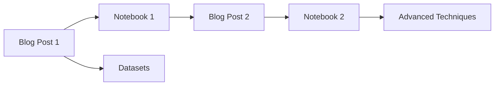

# Learn NLP with Fatima Code Companion


[](LICENSE)
[](https://colab.research.google.com/github/yourusername/repo-name)
[](https://github.com/yourusername/repo-name/discussions)

Welcome to the official code repository for the **"Learn NLP with Fatima"** series. This companion resource contains all runnable code samples, notebooks, and datasets referenced in the articles.



## 🚀 Series Navigation

| Part | Topic | Notebook | Article | 
|------|-------|----------|---------|
| 1 | Natural Language Processing Basics | [](link-to-colab1) | [Read Article](https://mahia.hashnode.dev/natural-language-processing-basics) |
| 2 | Part of Speech Tagging and Named Entity Recognition | [](link-to-colab2) | [Read Article](https://mahia.hashnode.dev/nlp-part-of-speech-tagging-and-named-entity-recognition) |
| 3 | Semantics and Sentiment Analysis | [](link-to-colab3) | [Coming Soon]() |
| 4 | Topic modeling | []() | [Coming Soon]() |
| 5 | Deep Learrning for NLP | []() | [Coming Soon]() |

## 🛠️ Quick Start

### Running Notebooks
1. Click any Colab badge above
2. Select "Run in Google Colab"
3. Execute cells sequentially


## 📂 Repository Structure
```
├── posts/
│   ├── 01-intro-nlp/          # Each post has dedicated folder
│   │   ├── notebook.ipynb      # Main Colab notebook
│   │   ├── assets/             # Images/data
│   │   └── README.md           # Post-specific details
│   │
│   ├── 02-custom-entities/
│   └── ...
│
├── common/                    # Shared resources
│   ├── utils.py               # Helper functions
│   └── datasets/              # Common datasets
│
├── .github/                   # Contribution templates
├── LICENSE
└── requirements.txt           # Core dependencies
```

## 💬 Join the Discussion
Have questions or suggestions? Engage with our community:
- [Start a Discussion](https://github.com/fatimajannet/NLP-with-Fatima/discussions/new?category=blog)
- [Report an Issue](https://github.com/fatimajannet/NLP-with-Fatima/issues/new/choose)

**Pro Tip:** When asking about a specific post:
```markdown
### Post Reference
Part: 2 - Custom Entity Recognition  
Section: "Handling Hyphenated Terms"  
Notebook Cell: [Cell 15](link-to-colab2#cell-15)
```

## 🌟 Featured Code Snippet
```python
def add_custom_entity(doc, text, label):
    """Add custom entity to spaCy Doc"""
    from spacy.tokens import Span
    
    # Create matcher pattern
    pattern = nlp(text)
    matcher.add(label, [pattern])
    
    # Apply matcher and add entities
    matches = matcher(doc)
    new_ents = [Span(doc, start, end, label=label) 
                for _, start, end in matches]
    
    # Update doc.ents
    doc.ents = list(doc.ents) + new_ents
    return doc
```

## 🤝 Contributing
We welcome improvements! Here's how:
1. Fork the repository
2. Create a branch (`git checkout -b improve/feature`)
3. Commit changes (`git commit -am 'Add amazing feature'`)
4. Push to branch (`git push origin improve/feature`)
5. Open a Pull Request

## 📜 License
This repository is licensed under the [MIT License](LICENSE). All blog content remains © Fatima.

---

**Maintained with ❤️ by Fatima**  

